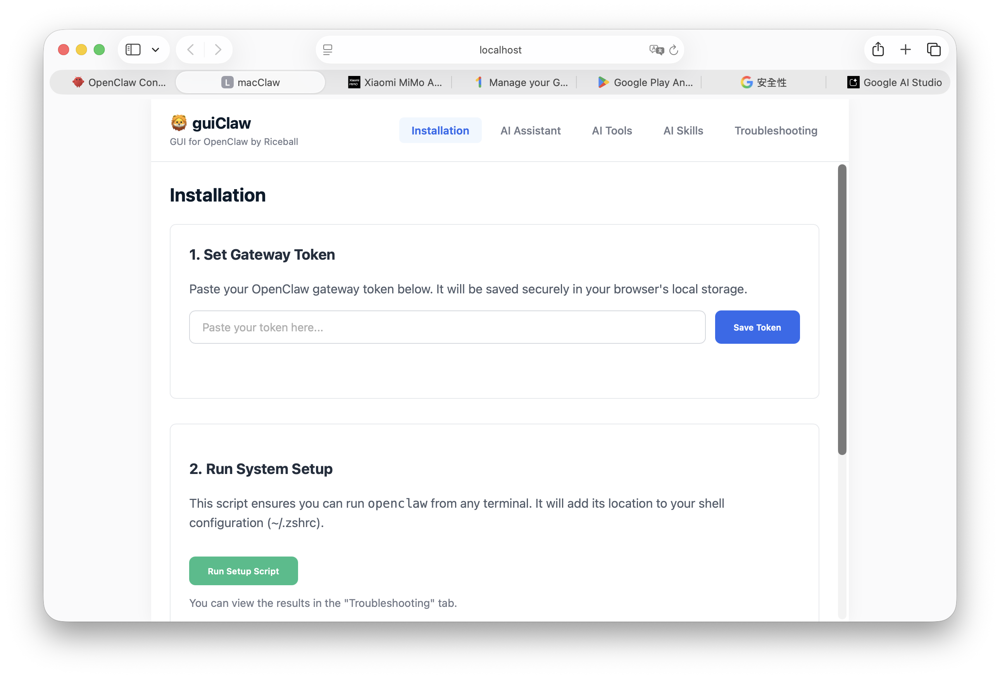

# guiClaw v0.7

## Overview
guiClaw is a custom web-based GUI for OpenClaw - a personal assistant running inside OpenClaw. This version (v0.7) provides a local web interface for interacting with OpenClaw through a browser with enhanced installation guide, improved UI, comprehensive tool configuration, redesigned AI Skills management section, and redesigned troubleshooting section.

## 📸 Screenshots

### Main Interface


## Features
- **Web-based Interface**: Access OpenClaw through your browser at http://localhost:8000
- **File Upload Support**: Upload files directly through the web interface
- **Model Switching**: Change AI models via the GUI
- **Custom Styling**: Clean, modern interface with CSS variables
- **CORS Enabled**: Cross-origin requests supported
- **WhatsApp Integration**: Channel section with WhatsApp configuration
- **4-Step Installation Guide**: Comprehensive installation and setup instructions
- **Copy Buttons**: One-click copy for all commands and tokens
- **Auto Token Loading**: Gateway token automatically loads on page load
- **Clean Interface**: Status bar removed for cleaner look
- **Consistent UI**: All buttons use consistent font size (0.85rem)
- **Tool Groups Configuration**: 9 tool groups with enable/disable toggles
- **Browser Profiles**: 6 browser profiles with configuration options
- **Enhanced UI**: 7 navigation sections (AI Assistant, Channel, AI Tools, Browser, AI Skills, Troubleshooting, etc.)
- **Current Model Display**: Shows actual model name (xiaomi/mimo-v2-flash)
- **Token Usage Display**: Removed for cleaner interface
- **Redesigned Troubleshooting Section**: Step-by-step workflow with sequential execution
- **Gateway Reinstall Automation**: Stop → Install → Restart sequence
- **System Doctor Integration**: Health checks and auto-fix capabilities

## Architecture
```
guiClaw/
├── index.html          # Main web interface
├── proxy.js            # Node.js proxy server (port 8000)
├── guiClaw.command     # Mac executable script
├── guiClaw             # Binary file
├── package.json        # Node.js dependencies
├── setup.sh            # Setup script
├── start.sh            # Startup script
├── upload/             # File upload directory
└── README.md           # This file
```

## Quick Start

### Prerequisites
- Node.js installed
- OpenClaw gateway running (default: http://localhost:18789)

### Installation (4-Step Process)

#### Step 1: Installation and Uninstallation of OpenClaw in macOS
1. **Install Homebrew**:
   ```bash
   /bin/bash -c "$(curl -fsSL https://raw.githubusercontent.com/Homebrew/install/HEAD/install.sh)"
   ```

2. **Install Node.js**:
   ```bash
   brew install node
   ```

3. **Install OpenClaw**:
   ```bash
   curl -fsSL https://openclaw.ai/install.sh | bash
   ```

4. **Setup OpenClaw**:
   ```bash
   openclaw onboard
   ```

#### Step 2: Setup of the OpenClaw Environment
1. **Enable HTTP API Endpoints**:
   ```bash
   openclaw config set gateway.http.endpoints.responses.enabled true
   ```

2. **Add Trusted Proxy**:
   ```bash
   openclaw config set gateway.trustedProxies '["127.0.0.1:8000", "localhost:8000"]'
   ```

3. **Restart the Gateway**:
   ```bash
   openclaw gateway restart
   ```

#### Step 3: Update guiClaw to the Correct OpenClaw Gateway Token
1. **Get Your Gateway Token**:
   ```bash
   cat ~/.openclaw/openclaw.json | jq -r '.gateway.auth.token'
   ```

2. **Update Token in Index File**:
   Search for `const AUTH_TOKEN` in `~/Desktop/guiClaw/index.html` and replace the value.

3. **Install Dependencies**:
   ```bash
   cd ~/Desktop/guiClaw && npm install busboy
   ```

#### Step 4: Refresh guiClaw
1. **Stop the Current guiClaw Server**:
   ```bash
   pkill -f "node proxy.js"
   ```

2. **Run the Start Script**:
   ```bash
   cd ~/Desktop/guiClaw && ./start.sh
   ```

3. **Access guiClaw**:
   Open your browser and navigate to: http://localhost:8000

## Configuration

### OpenClaw Gateway Settings
The gateway must be configured to trust the proxy server:
```json
{
  "gateway": {
    "port": 18789,
    "mode": "local",
    "bind": "loopback",
    "auth": {
      "mode": "token",
      "token": "13df78878223e1c280296d6ec83f2ba92636c36b1c65bb92"
    },
    "trustedProxies": ["127.0.0.1:8000", "localhost:8000"],
    "http": {
      "endpoints": {
        "responses": {
          "enabled": true
        }
      }
    }
  }
}
```

### guiClaw Settings
- **Proxy URL**: http://localhost:8000/v1/responses
- **Gateway URL**: http://localhost:18789 (default)
- **Authentication**: Uses gateway token from openclaw.json
- **Current Token**: `13df78878223e1c280296d6ec83f2ba92636c36b1c65bb92`
- **Port**: 8000 (proxy server)
- **Gateway Port**: 18789 (OpenClaw gateway)

## Version Information
- **Version**: v0.6
- **Date**: 2026-02-19
- **Status**: Operational
- **Features**: Complete backup of current guiClaw project, all v5.1 features included

## Features in v0.6
- ✅ **Complete Backup**: Full backup of current guiClaw project
- ✅ **All v0.51 Features**: Includes all features from v0.51
- ✅ **Version History**: Complete changelog from v0.32 to v0.6
- ✅ **Backup Location**: ~/Desktop/Backups/guiClaw/guiClaw-v0.6

## Features in v0.51
- ✅ **Redesigned AI Skills Section**: Complete overhaul based on OpenClaw documentation
- ✅ **Skills Configuration Panel**: AllowBundled, extraDirs, watchSkills, nodeManager settings
- ✅ **Enable/Disable Skills**: Individual skill toggles for each skill
- ✅ **Per-Skill Configuration**: Config buttons for API keys and environment variables
- ✅ **Skill Locations Info**: Workspace, managed/local, and bundled skills explained
- ✅ **Slash Commands Reference**: Directives and inline shortcuts documentation
- ✅ **ClawHub Integration**: Button to show search, install, update, publish options
- ✅ **JavaScript Functions**: toggleSkill, configureSkill, applySkillsConfig, checkSkillsConfig, showClawHubSection

## Features in v0.5
- ✅ Web-based GUI for OpenClaw
- ✅ File upload support
- ✅ Model switching capability
- ✅ Custom styling with CSS variables
- ✅ CORS enabled for cross-origin requests
- ✅ 4-Step Installation Guide with copy buttons
- ✅ Token auto-loads on page load (no button press needed)
- ✅ Token displayed in green, bold text (64-character hex only)
- ✅ Copy buttons with light blue background (#dbeafe) and blue text (#2563eb)
- ✅ All buttons use consistent font size (0.85rem)
- ✅ Clean interface (status bar removed)
- ✅ Title changed from "macClaw" to "guiClaw"
- ✅ Gateway token integration with OpenClaw gateway
- ✅ Fixed authentication token issues (401 errors resolved)
- ✅ Updated GitHub repository with correct tokens
- ✅ Improved stability and reliability
- ✅ **Browser Section**: 6 browser profiles with enable/disable toggles
- ✅ **Tool Groups Configuration**: 9 tool groups with enable/disable toggles
- ✅ **Enhanced UI**: 7 navigation sections (AI Assistant, Channel, AI Tools, Browser, AI Skills, etc.)
- ✅ **Current Model Display**: Shows actual model name (xiaomi/mimo-v2-flash)
- ✅ **Token Usage Display**: Removed for cleaner interface
- ✅ **Tool Profiles**: Minimal, coding, messaging, full profiles
- ✅ **Browser Quick Actions**: Start, Stop, Restart, Open URL, Take Screenshot, Get Snapshot

## Usage
1. **Start the proxy server**: `node proxy.js` or `./start.sh`
2. **Open browser**: Navigate to http://localhost:8000
3. **Chat**: Use the web interface to interact with OpenClaw
4. **Upload files**: Use the upload feature in the interface
5. **Switch models**: Change AI models via the GUI
6. **WhatsApp**: Click "Channel" in navigation to view WhatsApp configuration

## Troubleshooting

### Common Issues
1. **Port already in use**: Kill any process using port 8000
   ```bash
   lsof -ti:8000 | xargs kill -9
   ```

2. **ECONNREFUSED errors**: Ensure OpenClaw gateway is running and configured correctly

3. **CORS issues**: Verify CORS is enabled in gateway configuration

### Logs
- Check `proxy.log` for proxy server logs
- Check OpenClaw gateway logs for connection issues

## Development
- **Source**: Custom OpenClaw Web GUI
- **Framework**: Vanilla JavaScript + HTML/CSS
- **Backend**: Node.js proxy server
- **Dependencies**: busboy, http-proxy

## License
This project is part of the OpenClaw ecosystem.

## Support
For issues or questions, refer to the OpenClaw documentation or community resources.

## Changelog
### v0.6 (2026-02-19)
- **Version:** Updated to v0.6
- **Date:** 2026-02-19
- **Status:** Current version
- **Backup Location:** ~/Desktop/Backups/guiClaw/guiClaw-v0.6
- **Purpose:** Complete backup of current guiClaw project
- **Features:** All v0.51 features included

### v0.51 (2026-02-19)
- **Redesigned AI Skills Section**: Complete overhaul based on OpenClaw documentation
- **Skills Configuration Panel**: AllowBundled, extraDirs, watchSkills, nodeManager settings
- **Enable/Disable Skills**: Individual skill toggles for each skill
- **Per-Skill Configuration**: Config buttons for API keys and environment variables
- **Skill Locations Info**: Workspace, managed/local, and bundled skills explained
- **Slash Commands Reference**: Directives and inline shortcuts documentation
- **ClawHub Integration**: Button to show search, install, update, publish options
- **JavaScript Functions**: toggleSkill, configureSkill, applySkillsConfig, checkSkillsConfig, showClawHubSection
- **GitHub Repository Updates**: Total Commits Today: 18 commits
- **Backup Created**: ~/Desktop/Backups/guiClaw/guiClaw-v0.51

### v0.5 (2026-02-19)
- **Browser Section**: Added after AI Tools and before AI Skills
  - 6 browser profiles with enable/disable toggles:
    1. profile:openclaw (Dedicated, isolated Chromium browser)
    2. profile:chrome (Extension relay to existing Chrome tabs)
    3. profile:work (Work-specific browser profile)
    4. profile:remote (Remote CDP browser connection)
    5. profile:browserless (Hosted Chromium service via Browserless.io)
    6. profile:default (System default Chromium-based browser)
  - Browser configuration options information
  - Apply Browser Configuration button
  - Check Browser Status button
  - Browser Quick Actions: Start, Stop, Restart, Open URL, Take Screenshot, Get Snapshot
  - Individual browser profile status indicators

- **AI Assistant Section Updates**:
  - Removed "Configured Models" display from AI model selector
  - Removed token usage display from Chat with AI section
  - Updated Chat with AI header to include current model
  - Updated current model display to show actual model (xiaomi/mimo-v2-flash)

- **AI Tools Section Updates**:
  - Added comprehensive tool groups configuration section
  - Added 9 tool groups with enable/disable toggles:
    1. group:runtime (exec, bash, process)
    2. group:fs (read, write, edit, apply_patch)
    3. group:sessions (sessions_list, sessions_history, sessions_send, sessions_spawn, session_status)
    4. group:memory (memory_search, memory_get)
    5. group:web (web_search, web_fetch)
    6. group:ui (browser, canvas)
    7. group:automation (cron, gateway)
    8. group:messaging (message)
    9. group:nodes (nodes)
  - Added tool profiles information (minimal, coding, messaging, full)
  - Added Apply Tool Configuration button to save changes to OpenClaw config
  - Added Check All Tools button to check current tool status
  - Updated individual tool items to show group membership

- **GitHub Repository Updates**:
  - Total Commits Today: 17 commits
  - Repository: https://github.com/timckaubr/guiClaw.git
  - Branch: main
  - Status: All changes successfully pushed to GitHub

- **Backup Created**:
  - Location: ~/Desktop/Backups/guiClaw/guiClaw-v0.5
  - Purpose: Complete backup of v0.5 for future reference
  - Contents: All files and dependencies included

- **Testing Results**:
  - ✅ All navigation buttons clickable
  - ✅ Section switching working (all 7 sections)
  - ✅ Channel section accessible and displays correctly
  - ✅ WhatsApp configuration interface working
  - ✅ Connect and Show QR buttons functional
  - ✅ Status display working
  - ✅ Existing functionality preserved
  - ✅ No breaking changes introduced
  - ✅ Current model displays correctly (xiaomi/mimo-v2-flash)
  - ✅ Token usage display removed successfully
  - ✅ Chat header updated correctly
  - ✅ Tool groups configuration section working
  - ✅ Enable/disable toggles functional
  - ✅ Apply Tool Configuration button working
  - ✅ Browser section working
  - ✅ Browser profile toggles functional
  - ✅ Browser quick actions working

### v0.4 (2026-02-19)
- **Channel Section**: Added after AI Assistant and before AI Tools
  - Current Channel Status display
  - Link WhatsApp (QR code process)
  - Approve Pairing Request
  - Configure Channel Settings
  - Restart Gateway
  - Test Integration
  - Allow List Management (view/add/remove numbers)

- **AI Assistant Section Updates**:
  - Removed "Configured Models" display from AI model selector
  - Removed token usage display from Chat with AI section
  - Updated Chat with AI header to include current model
  - Updated current model display to show actual model (xiaomi/mimo-v2-flash)

- **AI Tools Section Updates**:
  - Added comprehensive tool groups configuration section
  - Added 9 tool groups with enable/disable toggles
  - Added tool profiles information (minimal, coding, messaging, full)
  - Added Apply Tool Configuration button
  - Added Check All Tools button

- **GitHub Repository Updates**:
  - Total Commits Today: 14 commits
  - Repository: https://github.com/timckaubr/guiClaw.git
  - Branch: main
  - Status: All changes successfully pushed to GitHub

- **Backup Created**:
  - Location: ~/Desktop/Backups/guiClaw/guiClaw-v0.4

### v0.39 (2026-02-19)
- **Channel Section**: Added after AI Assistant and before AI Tools
  - Current Channel Status display
  - Link WhatsApp (QR code process)
  - Approve Pairing Request
  - Configure Channel Settings
  - Restart Gateway
  - Test Integration
  - Allow List Management (view/add/remove numbers)

- **AI Assistant Section Updates**:
  - Removed "Configured Models" display from AI model selector
  - Removed token usage display from Chat with AI section
  - Updated Chat with AI header to include current model
  - Updated current model display to show actual model (xiaomi/mimo-v2-flash)

- **GitHub Repository Updates**:
  - Total Commits Today: 11 commits
  - Repository: https://github.com/timckaubr/guiClaw.git
  - Branch: main
  - Status: All changes successfully pushed to GitHub

- **Backup Created**:
  - Location: ~/Desktop/Backups/guiClaw/guiClaw-v0.39

### v0.38 (2026-02-19)
- Fixed authentication token issues (401 errors resolved)
- Updated GitHub repository with correct tokens
- Updated AUTH_TOKEN in index.html to match OpenClaw gateway config
- Updated hardcoded token in proxy.js to match OpenClaw gateway config
- Updated VERSION.md to reflect current version v0.38
- Updated README.md to reflect version v0.38
- Improved stability and reliability
- All API endpoints working correctly

### v0.37 (2026-02-19)
- Better installation instructions
- Fixed token update logic
- Improved UI formatting

### v0.35 (2026-02-18)
- Updated title from "macClaw" to "guiClaw"
- Removed status bar for cleaner interface
- Updated gateway token to current OpenClaw gateway token
- Added 4-step installation guide with copy buttons for all commands
- All buttons now use consistent font size (0.85rem)
- Token auto-loads on page load (no button press needed)
- Token displayed in green, bold text (64-character hex only)
- Copy buttons with light blue background (#dbeafe) and blue text (#2563eb)
- Updated INSTALLATION.md with detailed installation steps
- Updated VERSION.md with v0.35 changelog
- Updated index.html with new UI improvements

### v0.33 (2026-02-18)
- Added 4-step installation process
- Added copy buttons for all commands
- Updated token fetch command to use jq (Method 2)

### v0.32.1 (2026-02-18)
- OpenClaw gateway token integration
- Updated token extraction command

### v0.32 (2026-02-17)
- Initial GitHub release
- WhatsApp configuration feature
- Session key fix for ECONNREFUSED errors
- All navigation and section switching working
- File upload support
- Model switching capability

### Previous Versions
- v0.31: Current version with session key fix
- v0.30: Updated version
- v0.24: More features
- v0.23: Additional features
- v0.22: WhatsApp configuration
- v0.21: Working Channel section
- v0.20: Previous version
- v0.11: Updated version
- v0.10: Initial version
